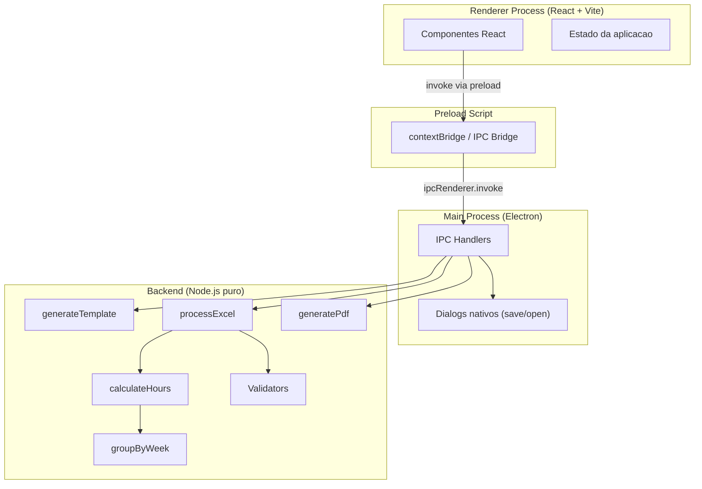
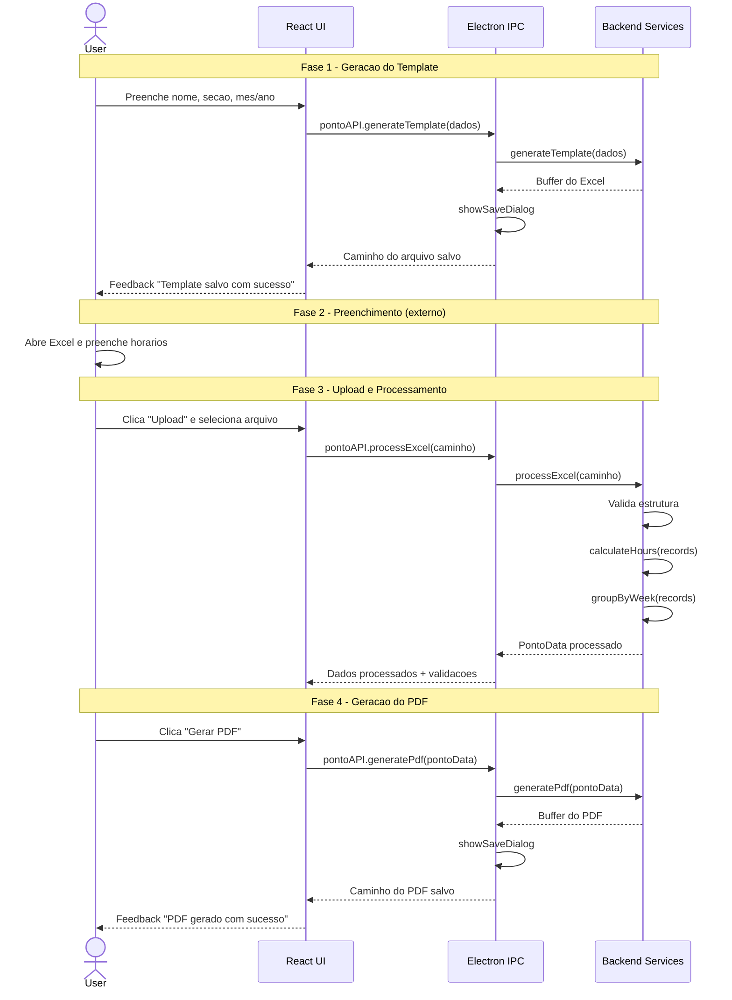

# Plano de Implementacao - PontoApp

---

## 1. Arquitetura do Sistema

A aplicacao segue o modelo de tres camadas do Electron, com separacao clara de responsabilidades:



### Responsabilidades por camada

**Electron Main (`src/main/`)**

- Criacao e gerenciamento da `BrowserWindow`
- Registro dos `ipcMain.handle()` para cada operacao (via `src/main/ipc/handlers.ts`)
- Acesso ao file system (dialogs `showSaveDialog`, `showOpenDialog`)
- Orquestracao: recebe chamadas do renderer, delega ao backend, retorna resultados

**Preload (`src/preload/index.ts`)**

- Expoe uma API segura via `contextBridge.exposeInMainWorld`
- O renderer NUNCA acessa `ipcRenderer` diretamente
- API exposta: `window.pontoAPI.generateTemplate(...)`, `window.pontoAPI.processExcel(...)`, `window.pontoAPI.generatePdf(...)`

**Frontend React (`src/`)**

- Interface do usuario: formulario de entrada, upload de arquivo, feedback visual
- Chama `window.pontoAPI.` para todas as operacoes
- Nao contem logica de negocio

**Backend (`backend/`)**

- Toda a logica de negocio: geracao de Excel, leitura, calculo, agrupamento, geracao de PDF
- Funcoes puras sem dependencia do Electron
- Testavel isoladamente

---

## 2. Fluxo da Aplicacao



---

## 3. Modelagem de Dados

Todos os tipos ficam em `backend/types/ponto.ts`:

```typescript
interface PontoHeader {
  empresa: string; // fixo: "PROTMAX SERVICOS EM CONDOMINIO"
  nome: string;
  secao: string;
  mes: number; // 1-12
  ano: number; // ex: 2026
}

interface TimeEntry {
  hora: number;
  minuto: number;
}

interface PontoRecord {
  dia: number; // 1-31
  diaSemana: string; // "DOMINGO", "SEGUNDA", etc.
  entrada: TimeEntry | null;
  inicioIntervalo: TimeEntry | null;
  fimIntervalo: TimeEntry | null;
  saida: TimeEntry | null;
  folga: boolean;
  minutesTrabalhados?: number; // opcional: preenchido somente apos calculateHours (Fase 5)
  // undefined durante Fase 4 (leitura+validacao), 0 se folga
}

interface WeekGroup {
  inicio: number; // dia de inicio da semana
  fim: number; // dia de fim (sabado ou ultimo dia do mes)
  records: PontoRecord[];
  totalMinutos: number;
  totalFormatado: string; // "HH:mm"
}

interface PontoData {
  header: PontoHeader;
  records: PontoRecord[];
  weeks: WeekGroup[];
  totalMensalMinutos: number;
  totalMensalFormatado: string; // "HH:mm"
}

interface ValidationError {
  dia: number;
  campo: string;
  mensagem: string;
}

interface ProcessResult {
  success: boolean;
  data?: PontoData;
  errors?: ValidationError[];
}
```

**Decisao importante**: armazenar horas trabalhadas em **minutos** (inteiro) internamente, convertendo para `HH:mm` somente na apresentacao. Isso evita problemas de arredondamento com floats.

---

## 4. Servicos do Backend

### 4.1 `generateTemplate(header: PontoHeader): Promise<Buffer>`

- Usa **exceljs** para criar o workbook
- Gera cabecalho nas primeiras linhas (merge de celulas)
- Calcula dias do mes com `dayjs`: `dayjs(\`${ano}-${mes}-01).daysInMonth()`
- Para cada dia: insere linha com dia, dia da semana (dayjs `.format('dddd')`), e 4 colunas vazias
- Aplica estilos: bordas, negrito no cabecalho, largura de colunas
- Retorna o buffer (`workbook.xlsx.writeBuffer()`)

### 4.2 `parseExcelTime(value: unknown): TimeEntry | null` (funcao central - `timeUtils.ts`)

Funcao critica que centraliza TODO o parsing de horarios vindos do Excel. Deve ser a unica porta de entrada para converter valores de celula em `TimeEntry`.

- **string `"HH:mm"`**: faz parse via regex `/^([01]\d|2[0-3]):([0-5]\d)$/`, retorna `{ hora, minuto }`
- **numero serial do Excel**: o Excel armazena horarios como fracao de dia (ex: 0.75 = 18:00). Converter: `hora = Math.floor(value * 24)`, `minuto = Math.round((value * 24 - hora) * 60)`. Tratar arredondamento de ponto flutuante com tolerancia de 0.0001
- **objeto Date do JS**: a lib `xlsx` pode converter seriais para Date automaticamente. Extrair `getHours()` e `getMinutes()` via UTC para evitar offset de timezone
- **celula vazia / undefined / null**: retorna `null`
- **qualquer outro valor**: lanca `ValidationError` indicando o dia e campo

Toda chamada de leitura de horario em `processExcel` e `excelValidator` DEVE passar por `parseExcelTime`. Nunca fazer parse manual inline.

### 4.3 `processExcel(filePath: string): Promise<ProcessResult>` (orquestrador central)

`processExcel` e o **orquestrador** de todo o pipeline de processamento. Ele nao contem logica de calculo ou validacao diretamente — delega para servicos especializados em uma sequencia bem definida:

```
processExcel(filePath)
  |
  ├─ 1. Leitura: xlsx.readFile(filePath)
  |      Extrai cabecalho (nome, secao, mes/ano) das celulas esperadas
  |
  ├─ 2. Parsing: para cada linha da tabela
  |      ├─ Verifica coluna "Entrada" para FOLGA (case-insensitive, somente essa coluna)
  |      ├─ Ignora linhas completamente vazias
  |      └─ Converte cada celula de horario via parseExcelTime(value)
  |      Resultado: PontoRecord[] com minutesTrabalhados = undefined
  |
  ├─ 3. Validacao: excelValidator.validate(records)
  |      ├─ Estrutura (colunas, cabecalho)
  |      ├─ Completude all-or-nothing
  |      ├─ Ordem logica dos horarios
  |      └─ Se erros: retorna ProcessResult { success: false, errors }
  |
  ├─ 4. Calculo: para cada record valido
  |      └─ record.minutesTrabalhados = calculateHours(record)
  |
  └─ 5. Agrupamento: groupByWeek(records, mes, ano)
         Resultado final: PontoData com weeks[] e totalMensal
```

- O IPC handler chama APENAS `processExcel` — nunca chama calculateHours ou groupByWeek diretamente
- Se a validacao (passo 3) falha, os passos 4 e 5 NAO sao executados
- Retorna `ProcessResult` com dados completos ou lista de erros

### 4.4 `calculateHours(record: PontoRecord): number`

- Funcao pura: recebe um record, retorna minutos trabalhados
- Formula: `(saida - entrada) - (fimIntervalo - inicioIntervalo)`
- Conversao: `TimeEntry` -> minutos desde meia-noite (`hora * 60 + minuto`)
- Retorna 0 se `folga === true`
- Lanca erro se resultado for negativo (horarios inconsistentes)

### 4.5 `groupByWeek(records: PontoRecord[], mes: number, ano: number): WeekGroup[]`

- Usa dayjs para determinar o dia da semana do dia 1 do mes
- Agrupa records em semanas (domingo a sabado)
- Regra de fechamento:
  - Se o sabado pertence ao mes -> fecha no sabado
  - Se o mes termina antes do sabado -> fecha no ultimo dia do mes
  - Se o mes comeca no meio da semana -> a primeira semana e parcial (do dia 1 ate o proximo sabado)
- Calcula totalMinutos e totalFormatado para cada grupo

### 4.6 `generatePdf(data: PontoData): Promise<Buffer>`

- Usa **pdfmake** como biblioteca padrao (declarativo, excelente suporte a tabelas complexas)
- **Fallback para pdfkit**: se durante a implementacao o pdfmake apresentar limitacoes de layout (ex: controle fino de posicionamento de rodape, estilos condicionais por linha), migrar para pdfkit. O pdfkit oferece controle pixel-a-pixel mas exige calculo manual de posicoes. A interface `generatePdf(data: PontoData): Promise<Buffer>` permanece identica independentemente da lib escolhida, isolando o impacto da troca
- Estrutura do documento:
  - Cabecalho: titulo + empresa + nome + secao
  - Tabela principal com colunas: Dia, Dia Semana, Entrada, Inicio Intervalo, Fim Intervalo, Saida, Total Semana, Assinatura, Justificativa
  - "Total Semana" preenchido APENAS nas linhas de fechamento semanal (sabado ou ultimo dia do mes)
  - **Justificativa**: coluna SEMPRE vazia no PDF gerado. Nenhuma logica de preenchimento automatico. O campo existe exclusivamente para preenchimento manual pos-impressao
  - Rodape: Total Mensal, Data (formato **/**/), Assinatura do Supervisor
- Configuracao A4 vertical, margens reduzidas, fonte pequena (~7-8pt) para caber tudo em uma pagina
- Larguras de coluna otimizadas: Assinatura maior, Justificativa menor

---

## 5. Estrategia de Tratamento de Datas

### Semana comecando no domingo (regra fundamental)

```
dayjs().day() retorna: 0=domingo, 1=segunda, ..., 6=sabado
```

- A semana SEMPRE comeca no domingo (`day() === 0`) e termina no sabado (`day() === 6`)
- O fechamento semanal (onde exibir o "Total Semana" no PDF) ocorre:
  - No sabado (`day() === 6`), OU
  - No ultimo dia do mes, se o mes termina antes do proximo sabado (semana incompleta)
- O "Total Semana" NAO aparece no domingo (inicio), e sim no dia de fechamento

### Algoritmo de agrupamento

```
1. grupoAtual = novo WeekGroup
2. Para cada dia do mes (1..N):
   a. Adiciona o record ao grupoAtual
   b. Se day() === 6 (sabado) OU dia === ultimoDiaDoMes:
      - Fecha grupoAtual: calcula totalMinutos somando minutesTrabalhados de cada record
      - Adiciona grupoAtual à lista de semanas
      - Se dia !== ultimoDiaDoMes: grupoAtual = novo WeekGroup
3. Retorna lista de semanas
```

### Tratamento de meses incompletos (cenarios criticos)

- **Primeira semana parcial**: se o dia 1 cai numa quarta-feira, a primeira semana vai de quarta a sabado (4 dias). O total semanal e calculado apenas sobre esses 4 dias
- **Ultima semana parcial**: se o dia 31 cai numa terca-feira, a ultima semana vai de domingo a terca (3 dias). O fechamento ocorre no dia 31, nao no sabado seguinte (que ja pertence ao proximo mes)
- **Mes comecando no domingo**: a primeira semana e completa (domingo a sabado)
- **Mes terminando no sabado**: a ultima semana e completa, fechamento normal no sabado

### Exemplo concreto: marco/2026

```
Marco 2026: dia 1 = domingo
Semana 1: dom 01 - sab 07 (completa, fecha no 07)
Semana 2: dom 08 - sab 14 (completa, fecha no 14)
Semana 3: dom 15 - sab 21 (completa, fecha no 21)
Semana 4: dom 22 - sab 28 (completa, fecha no 28)
Semana 5: dom 29 - ter 31 (parcial, fecha no 31)
```

### Locale

- Configurar `dayjs.locale('pt-br')` para nomes dos dias em portugues
- Plugin `dayjs/plugin/localeData` para formatos

---

## 6. Estrategia de Validacao

Implementada em `backend/validators/excelValidator.ts`:

### 6.1 Validacao de estrutura

- Verifica se o arquivo e um `.xlsx` valido
- Verifica se as celulas de cabecalho existem (nome, secao, mes)
- Verifica se a tabela tem as 6 colunas esperadas
- Verifica se o numero de linhas corresponde aos dias do mes

### 6.2 Validacao de horarios

- Todo valor de celula passa por `parseExcelTime(value)` antes de qualquer validacao
- Formato esperado apos parsing: `TimeEntry { hora, minuto }` ou `null`
- **Regra de completude (all-or-nothing)**: se QUALQUER um dos 4 campos de horario estiver preenchido, TODOS os 4 devem estar preenchidos. Campos parcialmente preenchidos geram erro:
  - Exemplo invalido: Entrada=08:00, Inicio Intervalo=12:00, Fim Intervalo=vazio, Saida=17:00
  - Erro: "Dia 15: campo 'Fim Intervalo' obrigatorio quando outros horarios estao preenchidos"
- **Ordem logica obrigatoria** (validar APOS confirmar que todos os 4 campos existem):
  - `entrada < inicioIntervalo` (estritamente menor, NAO pode ser igual)
  - `inicioIntervalo < fimIntervalo`
  - `fimIntervalo < saida`
  - Se qualquer condicao falha, gerar erro especifico: "Dia 10: 'Fim Intervalo' (13:30) deve ser anterior a 'Saida' (13:00)"
- **Horarios iguais nao sao permitidos**: nenhum par de campos pode ter o mesmo valor. Exemplos de erro:
  - Entrada=08:00, Saida=08:00 -> "Dia 5: 'Entrada' (08:00) e 'Saida' (08:00) nao podem ser iguais"
  - Inicio Intervalo=12:00, Fim Intervalo=12:00 -> "Dia 5: 'Inicio Intervalo' (12:00) e 'Fim Intervalo' (12:00) nao podem ser iguais"
  - Essa regra ja e coberta pelo operador `<` estrito (nao `<=`), mas deve gerar mensagem especifica de igualdade quando detectada, em vez da mensagem generica de ordem
- Comparacao feita em minutos: `toMinutes(entry) = entry.hora * 60 + entry.minuto`

### 6.3 Tratamento de FOLGA

- FOLGA e detectada **exclusivamente na coluna "Entrada"** (case-insensitive: `"FOLGA"`, `"folga"`, `"Folga"`)
- Se a coluna "Entrada" contem "FOLGA", a linha inteira e marcada como `folga: true`
- Quando `folga: true`, as demais colunas de horario (Inicio Intervalo, Fim Intervalo, Saida) sao ignoradas independentemente do conteudo
- Se "FOLGA" aparecer em outra coluna que nao "Entrada", NAO marcar como folga. Gerar aviso: "Dia 12: texto 'FOLGA' encontrado na coluna 'Saida'. FOLGA deve ser informada apenas na coluna 'Entrada'"

### 6.4 Retorno de erros

- Acumula todos os erros (nao para no primeiro)
- Cada erro indica: dia, campo e mensagem legivel
- Frontend exibe lista de erros para o usuario corrigir no Excel

---

## 7. Organizacao de Pastas

```
ponto-app/
├── src/
│   ├── main/                   # Electron main process (detectado automaticamente pelo electron-vite)
│   │   ├── index.ts            # Entry point Electron, cria BrowserWindow
│   │   └── ipc/
│   │       └── handlers.ts     # Registro de todos os ipcMain.handle()
│   ├── preload/                # Preload script (detectado automaticamente pelo electron-vite)
│   │   └── index.ts            # contextBridge com API segura
│   └── renderer/               # Frontend React (Vite)
│       ├── index.html          # HTML entry point
│       ├── main.tsx            # Entry point React
│       ├── App.tsx             # Componente raiz, gerencia fluxo
│       ├── components/
│       │   ├── TemplateForm.tsx    # Formulario: nome, secao, mes/ano
│       │   ├── FileUpload.tsx      # Drag & drop / seletor de arquivo
│       │   ├── ValidationErrors.tsx # Lista de erros de validacao
│       │   └── StatusFeedback.tsx  # Loading, sucesso, erro
│       ├── hooks/
│       │   └── usePontoAPI.ts      # Hook que encapsula window.pontoAPI
│       ├── styles/
│       │   └── global.css
│       └── types/
│           └── electron.d.ts       # Tipagem do window.pontoAPI
├── backend/
│   ├── services/
│   │   ├── generateTemplate.ts
│   │   ├── processExcel.ts
│   │   ├── calculateHours.ts
│   │   ├── groupByWeek.ts
│   │   └── generatePdf.ts
│   ├── validators/
│   │   └── excelValidator.ts
│   ├── utils/
│   │   ├── timeUtils.ts        # parseExcelTime (central), toMinutes, formatMinutes
│   │   └── dateUtils.ts        # getDaysInMonth, getDayName, getDayOfWeek
│   └── types/
│       └── ponto.ts            # Todas as interfaces/tipos
├── resources/                  # Assets para o build (icone, etc.)
├── package.json
├── tsconfig.json
├── tsconfig.node.json          # Config TS para Electron/backend
├── vite.config.ts
├── electron-builder.yml        # Config de empacotamento
└── README.md
```

---

## 8. Ordem de Implementacao

### Fase 1 - Scaffold

1. Inicializar projeto com `pnpm create electron-vite` (usa Vite + Electron integrado)
2. Configurar TypeScript, ESLint, estrutura de pastas conforme secao 7
3. Configurar `electron-builder` para build
4. Criar `electron/preload.ts` com `contextBridge` (API vazia por enquanto)
5. **Validacao**: `pnpm dev` abre janela Electron com pagina React em branco

### Fase 2 - Tipos e Utilitarios

1. Criar `backend/types/ponto.ts` com todas as interfaces (PontoHeader, TimeEntry, PontoRecord, WeekGroup, PontoData, ValidationError, ProcessResult)
2. Criar `backend/utils/timeUtils.ts`:

- `parseExcelTime(value: unknown): TimeEntry | null` - funcao central de parsing (string HH:mm, serial Excel, Date, null)
- `toMinutes(entry: TimeEntry): number` - converte para minutos desde meia-noite
- `formatMinutes(totalMinutes: number): string` - converte minutos para "HH:mm"

1. Criar `backend/utils/dateUtils.ts` (getDaysInMonth, getDayName, getDayOfWeek)
2. **Validacao**: testes unitarios de `parseExcelTime` com os 4 tipos de entrada (string, serial, Date, null). Testar `toMinutes` e `formatMinutes` com edge cases (00:00, 23:59, meia-noite)

### Fase 3 - Geracao do Template Excel

1. Implementar `backend/services/generateTemplate.ts` usando exceljs
2. Registrar IPC handler `generate-template` em `electron/ipc/handlers.ts`
3. Criar `TemplateForm.tsx` no frontend (formulario basico)
4. Conectar via preload bridge
5. **Validacao**: gerar template para meses com 28, 30 e 31 dias. Abrir no Excel E no LibreOffice. Verificar dias da semana corretos, cabecalho preenchido, colunas de horario vazias

### Fase 4 - Processamento do Excel (leitura e validacao apenas)

1. Implementar `backend/validators/excelValidator.ts`:

- Validacao de estrutura (colunas, cabecalho)
- Validacao de horarios via `parseExcelTime` (completude all-or-nothing, ordem logica)
- Deteccao de FOLGA exclusivamente na coluna "Entrada"

1. Implementar `backend/services/processExcel.ts`:

- Leitura com xlsx
- Extracao de cabecalho
- Iteracao sobre linhas com chamada ao validator
- Retorna records validados (SEM calculo de horas ainda)

1. **Validacao**: processar Excel com dados corretos, com FOLGA, com horarios invalidos, com celulas vazias. Verificar que erros sao acumulados e descritivos

### Fase 5 - Calculo de Horas e Agrupamento Semanal

1. Implementar `backend/services/calculateHours.ts`:

- Recebe PontoRecord, retorna minutesTrabalhados
- Formula: (saida - entrada) - (fimIntervalo - inicioIntervalo) em minutos
- Retorna 0 para folga

1. Implementar `backend/services/groupByWeek.ts`:

- Algoritmo de agrupamento domingo-sabado
- Fechamento no sabado ou ultimo dia do mes
- Tratamento de semanas parciais (inicio e fim do mes)

1. Integrar calculateHours e groupByWeek dentro de processExcel (processExcel agora retorna PontoData completo)
2. **Validacao**: testar com marco/2026 (comeca domingo, 31 dias). Verificar 5 grupos semanais. Testar com fevereiro/2026 (comeca domingo, 28 dias). Conferir totais semanais e mensal

### Fase 6 - Geracao do PDF

1. Implementar `backend/services/generatePdf.ts` usando pdfmake
2. Layout: cabecalho, tabela com 9 colunas, rodape com total mensal + assinatura
3. Coluna "Justificativa" sempre vazia (sem logica de preenchimento)
4. Coluna "Total Semana" preenchida somente nas linhas de fechamento
5. Registrar IPC handler `generate-pdf`
6. **Validacao**: gerar PDF para mes com 31 dias. Verificar que cabe em A4 vertical. Se nao couber, ajustar fonte/margens. Se pdfmake apresentar limitacoes de layout, avaliar migracao para pdfkit mantendo a mesma interface

### Fase 7 - Frontend Completo

1. Implementar `FileUpload.tsx` com drag & drop e seletor de arquivo
2. Implementar `ValidationErrors.tsx` (lista de erros com dia e campo)
3. Implementar `StatusFeedback.tsx` (loading spinner, toast de sucesso/erro)
4. Integrar fluxo completo no `App.tsx`: formulario -> gerar template -> upload -> processar -> gerar PDF
5. **Validacao**: teste end-to-end do fluxo completo. Testar com Excel valido, invalido, com FOLGA, com celulas vazias

### Fase 8 - Polish

1. Ajustar layout do PDF (fontes, margens, larguras de coluna) com testes visuais
2. Tratar edge cases de datas: fevereiro bissexto (2028), meses com 28/29/30/31 dias
3. Testar encoding UTF-8 com nomes acentuados (ex: "Joao da Conceicao", "Secao Administrativa")
4. Testar com dados reais fornecidos pelo usuario final
5. Refinar mensagens de erro para serem claras e acionaveis
6. Build final com `electron-builder` para Linux (e Windows se necessario)

---

## 9. Principais Riscos Tecnicos

### 9.1 Parsing de celulas do Excel

- **Risco**: `xlsx` pode interpretar horarios como objetos `Date` do JS, numeros seriais do Excel (ex: 0.75 = 18:00), ou strings `"HH:mm"`, dependendo da formatacao da celula e da aplicacao usada para editar (Excel vs LibreOffice vs Google Sheets)
- **Mitigacao**: toda leitura de horario passa obrigatoriamente pela funcao central `parseExcelTime(value)` em `timeUtils.ts`. Essa funcao trata os 4 tipos possiveis (string, serial numerico, Date, null) e e a unica responsavel por produzir `TimeEntry | null`. Nunca fazer parsing inline. Testar com arquivos salvos por diferentes aplicacoes na Fase 4

### 9.2 Layout do PDF em uma pagina A4

- **Risco**: meses com 31 dias geram 31+ linhas; com cabecalho (4 linhas), header da tabela (1 linha), rodape (3 linhas) e 9 colunas, o espaco e extremamente apertado em A4 vertical
- **Mitigacao**: usar fonte 7pt, margens de 15mm, padding minimo nas celulas (2pt vertical). **Teste obrigatorio na Fase 6**: gerar PDF com janeiro/2026 (31 dias, comeca quinta) e verificar que tudo cabe em uma unica pagina. Se nao couber, ajustes nesta ordem de prioridade: (1) reduzir fonte para 6.5pt, (2) reduzir margens para 10mm, (3) reduzir padding para 1pt, (4) como ultimo recurso, considerar orientacao paisagem

### 9.3 Seguranca do IPC

- **Risco**: expor `ipcRenderer` diretamente no renderer permite execucao arbitraria
- **Mitigacao**: usar `contextBridge` no preload, expondo APENAS as funcoes necessarias. Nunca expor `ipcRenderer` diretamente. Habilitar `contextIsolation: true` e `nodeIntegration: false`

### 9.4 Encoding de caracteres

- **Risco**: nomes com acentos (ex: "Joao", "Secao") podem corromper no Excel ou PDF
- **Mitigacao**: garantir UTF-8 em toda a cadeia. Testar com nomes acentuados desde o inicio

### 9.5 Compatibilidade do Excel gerado

- **Risco**: template gerado com exceljs pode ter formatacao nao preservada ao ser editado no LibreOffice
- **Mitigacao**: usar formatacao simples (sem macros, sem formulas complexas). Testar abertura e edicao no LibreOffice e no Excel

### 9.6 Timezone e locale

- **Risco**: `dayjs` pode gerar dias da semana errados se o locale nao estiver configurado
- **Mitigacao**: configurar `dayjs.locale('pt-br')` no bootstrap do backend. Usar UTC para calculo de datas, nao depender do fuso horario da maquina

---

## 10. Sugestoes de Melhoria Futura

- **Preview do PDF no app**: renderizar o PDF em um componente React antes de salvar (usando `react-pdf` ou iframe)
- **Historico**: salvar folhas de ponto anteriores em SQLite local para consulta
- **Edicao in-app**: permitir editar os horarios diretamente na interface, sem precisar do Excel externo
- **Impressao direta**: botao "Imprimir" que envia para a impressora do sistema
- **Multi-colaborador**: processar multiplos arquivos Excel em lote
- **Temas**: dark mode e light mode
- **Auto-update**: integrar `electron-updater` para atualizacoes automaticas
- **Exportacao adicional**: gerar CSV ou HTML alem de PDF
- **Relatorios**: dashboard com graficos de horas trabalhadas por semana/mes
- **Backup na nuvem**: sincronizar dados com Google Drive ou similar

---

## Dependencias do Projeto

```json
{
  "dependencies": {
    "exceljs": "^4.x",
    "xlsx": "^0.18.x",
    "dayjs": "^1.x",
    "pdfmake": "^0.2.x"
  },
  "devDependencies": {
    "electron": "^33.x",
    "electron-vite": "^2.x",
    "electron-builder": "^25.x",
    "react": "^19.x",
    "react-dom": "^19.x",
    "typescript": "^5.x",
    "@types/react": "^19.x",
    "vite": "^6.x"
  }
}
```

**Escolha do pdfmake como padrao**: pdfmake e declarativo e possui suporte nativo a tabelas complexas, o que e ideal para o layout tabelar da folha de ponto. **Fallback para pdfkit**: se o pdfmake apresentar limitacoes durante a implementacao (ex: controle fino de rodape, estilos condicionais por linha, problemas com fontes customizadas), migrar para pdfkit. A interface do servico (`generatePdf(data: PontoData): Promise<Buffer>`) permanece identica, isolando o impacto da troca. Adicionar `pdfkit` como dependencia opcional no package.json para facilitar a transicao se necessario.

**Escolha do electron-vite**: integra Vite com Electron de forma nativa, com HMR no renderer e rebuild automatico do main process. Evita configuracao manual de multiplos processos de build.
